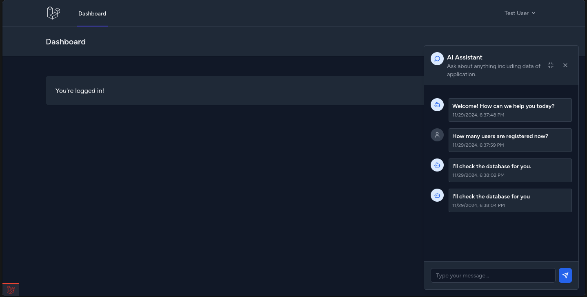

# Laravel AI Chat



## Installation

```bash
composer require dougkusanagi/laravel-ai-chat
php artisan vendor:publish --tag=ai-chat-config
php artisan vendor:publish --tag=ai-chat-assets
php artisan vendor:publish --tag=ai-chat-views
```

Set your Gemini API key in your .env file:

```env
GEMINI_API_KEY=your_api_key_here
```

## Usage

1. Add the required scripts to your layout file (`app.blade.php` or similar). Make sure to add them in this exact order:

```blade
<!DOCTYPE html>
<html>
<head>
    <!-- AI Chat JavaScript -->
    <script defer src="{{ asset('vendor/ai-chat/js/ai-chat.js') }}"></script>
</head>
<body>
    <!-- Your content -->
    
    <!-- Add the chat component wherever you want it to appear -->
    <x-ai-chat::ai-floating-chat />
</body>
</html>
```

2. Make sure you have Tailwind CSS installed and configured in your application.

3. The chat component will appear as a floating button in the bottom-right corner of your page.

## Customization

You can customize the views by publishing them:

```bash
php artisan vendor:publish --tag=ai-chat-views
```

The views will be published to `resources/views/vendor/ai-chat/components/`.

## Todo

- [x] Implement GeminiProvider
- [ ] Implement OpenAiProvider
- [ ] Implement AnthropicProvider

